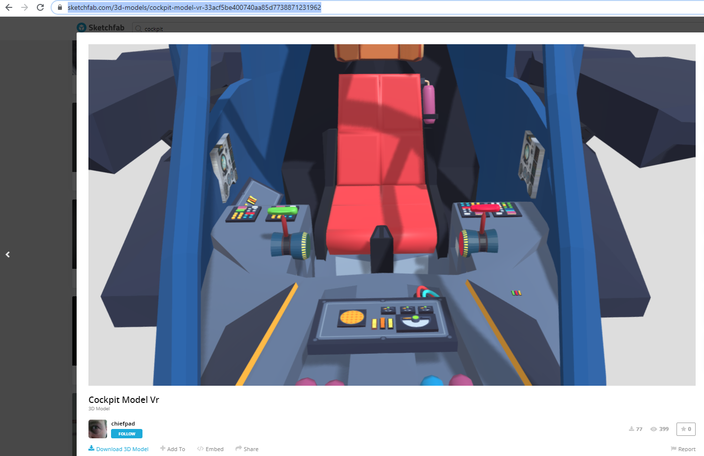

<!-- TABLE OF CONTENTS -->
## Table of Contents

* [About the Project](#about-the-project)
* [Getting Started](#getting-started)
  * [Prerequisites](#prerequisites)
  * [Installation](#installation)
* [Usage](#usage)

<!-- ABOUT THE PROJECT -->
## About The Project

The main purpose of this small project to achieve stepwise a final goal: ar race car. 
In this little example i demonstrate in 3 steps an AR demonstrator for desktop only. 
The android application is not included here. 

### Built With
One major framewrk is used to achieve the goal: three.js. 
Additionally, a free model is chosen for the demonstration, which can replaced as user wishes to do it so.  
Special thanks goes to "chiefpad" of sketchfab. 

* [threejs](https://threejs.org/)
* [Sketchfab](https://sketchfab.com/3d-models/cockpit-model-vr-33acf5be400740aa85d7738871231962)
